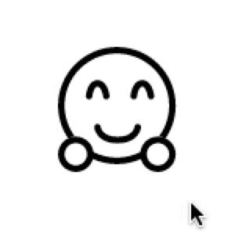

# 记一次有趣的需求实现 --- SVG 事件绑定

前一段时间在做一些关于 SVG 的工作，虽然做前端已经一年多了，接触真正的 SVG 操作我还是第一次，当然也避免不了踩一些坑。今天趁有空，总结一下里面最有意思的一个需求的实现，与大家分享。

## 需求描述

大家看到的这张图就是我们的初始效果，一张可爱的笑脸，当然是希望大家学习、生活、工作中每天都能微笑面对，少踩坑，多成就。


需求的功能分为以下几点

- 给笑脸加一个阴影，类似于太阳光的那种（把你的笑脸挥洒给身边的每一位热爱生活的朋友、同事，甚至是陌生人）
- 当鼠标位于笑脸上方时，阴影才显示
- 鼠标位于阴影边框上时，阴影不能消失

## 实现过程

下面，我就依次实现这几个需求，实现的最终代码在 https://github.com/caohuilin/svg_event_bind_example 。

如果大家心里已经有答案了，可以直接去看结果，是不是和你的想法一致，如果你有更好的实现方案，欢迎来给我提 issue，我们共同来探讨学习。

### 给笑脸加个阴影

首先先给笑脸加一个圆形边框，当然就是画一个圆了, 将 fill 置为白色，放在图标的下方。

```html
<circle id="path-1" fill="#FFFFFF" cx="75" cy="79" r="50"/>
```

接下来就是阴影的样式了，我的阴影样式是 sketch 生成的，自己写比较复杂，尝试了几次，最终还是放弃了。阴影的效果是重新定义的一个圆的样式。

```html
<filter x="-52.5%" y="-52.5%" width="205.0%" height="205.0%" filterUnits="objectBoundingBox" id="filter-2">
  <feMorphology radius="5" operator="dilate" in="SourceAlpha" result="shadowSpreadOuter1"/>
  <feOffset dx="0" dy="0" in="shadowSpreadOuter1" result="shadowOffsetOuter1"/>
  <feGaussianBlur stdDeviation="12.5" in="shadowOffsetOuter1" result="shadowBlurOuter1"/>
  <feColorMatrix values="0 0 0 0 0.970775187   0 0 0 0 0.907238424   0 0 0 0 0.109462149  0 0 0 1 0" type="matrix" in="shadowBlurOuter1"/>
</filter>
```

```html
<circle id="path-1" cx="75" cy="79" r="50" filter="url(#filter-2)"/>
```

这里应该注意图层的位置，最下层为阴影，接着是圆形的边框，然后才是笑脸。图层越靠下的越先定义，这样才能生成想要的效果。

最终的效果如下图：


### 当鼠标位于笑脸上方时，阴影才显示

你是不是想，这还不简单，直接在图标的图层上定义 mouseover 和 mouseout 事件不就好了，然后就产生了下面的代码

```html
<g
  onMouseOver={this.handleMouseOver}
  onMouseOut={this.handleMouseOut}
  dangerouslySetInnerHTML={{__html: smile}}
/>
```

这样看起来效果没什么问题，你试着在事件处理的地方加 log，你就会发现，鼠标只有在笑脸的实线区域移动时，阴影才会出现，这是什么原因呢？

原来，在 SVG 图层上定义事件，SVG 默认会将事件绑定在该图层上的每一个元素上，这个笑脸是由多个元素组成的，所以事件就相当于绑定在了每一条实线上了。（我当时处理的图标比较复杂，元素比较密集，结果就是事件一直被触发的跳动效果）

解决方案：在笑脸上面定义一个透明的圆，将事件绑定在圆上面。

```html
<circle
  id="path-1"
  onMouseOver={this.handleMouseOver}
  onMouseOut={this.handleMouseOut}
  fill="transparent"
  cx="75"
  cy="79"
  r="50"
/>
```

这样效果就实现了。



### 鼠标位于阴影边框上时，阴影不能消失

细心的朋友观察效果，是不是发现鼠标在靠近阴影的时候，阴影就消失了，这是因为阴影为样式，实际上并不存在实际的元素。那么怎样实现在阴影上也能触发对应的事件呢？

上面的思路是不是会给你启发，创建一个和阴影一样大的透明的圆。

```html
<circle
  id="path-1"
  cx="75"
  cy="79"
  r="75"
  onMouseOver={this.handleMouseOver}
  onMouseOut={this.handleMouseOut}
  fill="transparent"
/>
```

当然这个圆和阴影应该是一同出现，一同消失。

但是你神奇的发现，并没有实现你想要的效果，在鼠标靠近阴影时，阴影依旧消失了。原因其实很简单，因为你在触发阴影的 mouseover 事件之前，已经触发了笑脸的 mouseout 事件，阴影已经消失，mouseover 事件当然触发不了了。

新的想法又涌上心头，岂不是 mouseover 事件只需在笑脸上触发，mouseout 事件只需在阴影上触发，于是又大干了起来。

效果终于实现了！

这时的你松一口气准备做下一个需求了，突然鼠标不小心碰到了，迅速划过整个笑脸，你发现鼠标已在屏幕最下方，然而阴影还在，这又是怎么回事呢？

你又重新紧缩眉头，开始思考这个问题。。。

原来是 mouseover 事件触发阴影还没出现的时候，鼠标已经离开阴影区域造成的，这样就不可能触发 mouseout 事件了。这又该如何解决呢？

我想到一个解决方案，当鼠标离开笑脸时，创建一个定时器，将阴影去掉，如果在这个定时器时间内，阴影触发 mouseover 事件，那么定时器就被删除，否则定时器结束，阴影就消失了，这样也就不会发生因为鼠标快速通过造成的不期望的效果了。

不知道你是不是懂了，来动手试试吧。

```js
  handleMouseOver = (e) => {
    if (e.target === this.shadow && this.time) {
      clearTimeout(this.time)
    }
    this.setState({hovering: true});
  };
  handleMouseOut = (e) => {
    if (e.target === this.smile) {
      this.time = setTimeout(() => {
        this.setState({hovering: false})
      }, 100);
    } else {
      this.setState({hovering: false})
    }
  };
```

shadow 和 smile 分别是指阴影和笑脸的透明的圆的 DOM，这样需求就圆满解决了，开心😊 ！
